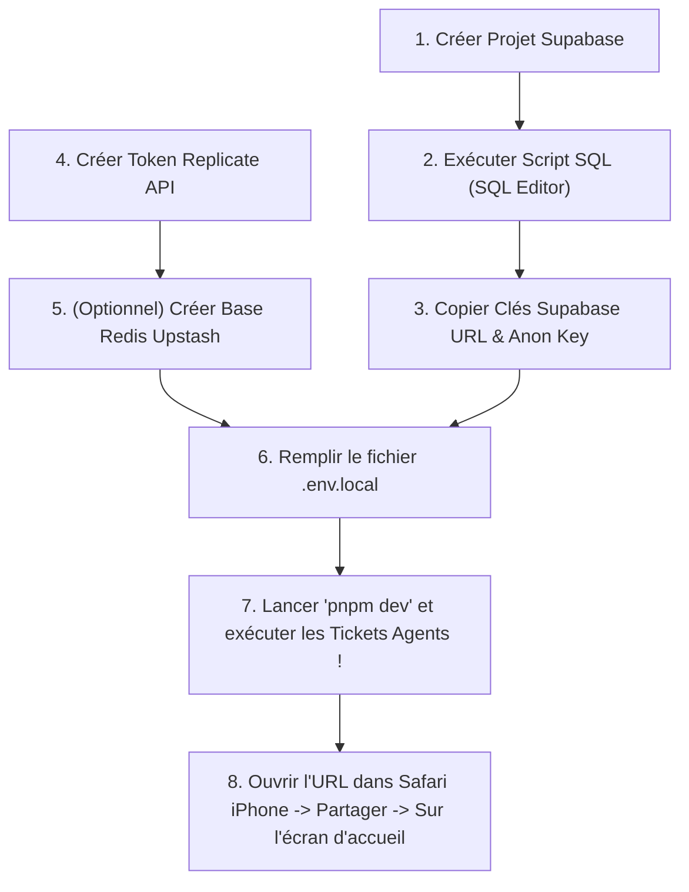

# 📋 Check-list des Actions à Réaliser Côté Utilisateur (Préalables au Lancement)

Ce document récapitule **toutes les démarches manuelles** que vous devez effectuer de votre côté (création de comptes, configuration des API, préparation de la base de données et des clés d'environnement) avant de lancer l'exécution des tickets par les agents.

---

## ⚡ 1. Base de Données & Authentification : Supabase

### 🔹 Étape 1.1 : Créer le Projet Supabase
1. Rendez-vous sur [Supabase.com](https://supabase.com) et connectez-vous (ou créez un compte gratuit).
2. Cliquez sur **"New Project"**.
3. Nommez le projet : `NutriVision AI` (ou `App Cherry`).
4. Définissez un mot de passe sécurisé pour la base de données PostgreSQL.
5. Sélectionnez la région la plus proche (ex: `eu-west-3` Paris ou `eu-central-1` Francfort).

### 🔹 Étape 1.2 : Récupérer les Clés API Supabase
1. Dans le tableau de bord Supabase, allez dans **Project Settings** > **API**.
2. Copiez les éléments suivants :
   - **Project URL** (ex: `https://xyzcompany.supabase.co`)
   - **anon / public key** (clé publique client)
   - **service_role key** (clé secrète admin serveur - *NE JAMAIS EXPOSER*)

### 🔹 Étape 1.3 : Exécuter la Migration SQL Initial
1. Dans le menu de gauche Supabase, ouvrez l'onglet **SQL Editor**.
2. Cliquez sur **"New Query"**.
3. Copiez-collez le contenu du fichier [`supabase/migrations/001_initial_schema.sql`](supabase/migrations/001_initial_schema.sql) (création des tables `profiles`, `user_goals`, `meals`, `meal_items`, `weekly_reports`, des politiques RLS, du trigger d'auto-création de profil et du bucket de stockage `meal-photos`).
4. Cliquez sur **"Run"** pour créer les schémas et activer la sécurité RLS.
5. Répétez l'opération avec [`supabase/migrations/002_enable_realtime_meals.sql`](supabase/migrations/002_enable_realtime_meals.sql) (active le Realtime sur `meals` pour un rafraîchissement instantané du tableau de bord).

---

## 🤖 2. IA Vision & LLM : Replicate API

### 🔹 Étape 2.1 : Créer un Compte & Clé API Replicate
1. Rendez-vous sur [Replicate.com](https://replicate.com) et connectez-vous avec votre compte GitHub.
2. Allez dans **Account** > **API Tokens**.
3. Cliquez sur **"Create token"**, nommez-le `NutriVision_App_Key`.
4. Copiez la clé générée (`r8_...`).

### 🔹 Étape 2.2 : Ajouter un Moyen de Paiement (ou Crédit d'Essai)
1. Replicate offre un crédit d'essai initial gratuit.
2. Pour éviter toute interruption lors des tests, associez une carte bancaire dans **Billing**. Comme calculé, 1 000 photos ne coûtent que **~0,45$ à 1,75$**.

---

## 🛡️ 3. Sécurité & Rate Limiting : Upstash Redis (optionnel pour l'instant)

### 🔹 Étape 3.1 : Créer une Base de Données Redis Upstash

1. Rendez-vous sur [Upstash.com](https://upstash.com) et créez un compte gratuit (ou connectez-vous).
2. Cliquez sur **"Create Database"**, choisissez le type **Redis**.
3. Nommez la base `nutrivision-ratelimit` et sélectionnez une région proche de votre déploiement (ex: `eu-west-1`).
4. Une fois la base créée, allez dans l'onglet **REST API**.
5. Copiez les valeurs **UPSTASH_REDIS_REST_URL** et **UPSTASH_REDIS_REST_TOKEN**.

> ℹ️ **Optionnel pour le développement local, recommandé avant la mise en production.** Le rate limiting des routes `/api/ai/*` (via `@upstash/ratelimit`, cf. `TICK-001`/`TICK-005`/`TICK-016`) peut être désactivé tant que ces identifiants ne sont pas renseignés — l'agent Backend doit prévoir un mode "no-op" quand `UPSTASH_REDIS_REST_URL`/`TOKEN` sont absents, plutôt que de faire planter les routes IA. Vous pourrez revenir compléter cette étape plus tard.

---

## 🔑 4. Fichier de Configuration d'Environnement (`.env.local`)

À la racine du projet frontend/backend, créez un fichier `.env.local` et complétez les valeurs suivantes :

```env
# ==========================================
# 🍏 NutriVision AI / App Cherry - Env Vars
# ==========================================

# 1. Supabase Config (Client & Serveur)
NEXT_PUBLIC_SUPABASE_URL="https://votre-projet.supabase.co"
NEXT_PUBLIC_SUPABASE_ANON_KEY="votre_cle_anon_publique_ici"
SUPABASE_SERVICE_ROLE_KEY="votre_cle_service_role_secrete_ici"

# 2. Replicate API Config (Strictement Serveur)
REPLICATE_API_TOKEN="r8_votre_token_replicate_secretd_ici"

# 3. Security & Rate Limiting (Optionnel pour Dev local, Recommandé Prod)
UPSTASH_REDIS_REST_URL="https://votre-redis.upstash.io"
UPSTASH_REDIS_REST_TOKEN="votre_upstash_token_ici"

# 4. App Config
NEXT_PUBLIC_APP_URL="http://localhost:3000"
```

---

## 🛠️ 5. Environnement de Développement Local

Assurez-vous que les outils suivants sont installés sur votre ordinateur :
- [x] **Node.js** (Version 18.x LTS ou 20.x LTS).
- [x] **pnpm** ou **npm** (pnpm est recommandé : `npm i -g pnpm`).
- [x] **Git** configuré.

---

## 📱 6. Installer l'app sur iPhone

L'application est conçue comme une **PWA (Progressive Web App)** : elle s'installe sur iPhone directement depuis Safari, sans passer par l'App Store et **sans compte Apple Developer**.

### 🔹 Étape 6.1 : Ouvrir l'app dans Safari

1. Une fois l'application déployée (ex: sur Vercel) ou lancée en local (`pnpm dev`), ouvrez son URL dans **Safari** sur votre iPhone (Safari est obligatoire, Chrome iOS ne permet pas l'installation).

### 🔹 Étape 6.2 : Ajouter à l'écran d'accueil

1. Appuyez sur l'icône **Partager** (le carré avec une flèche vers le haut) dans la barre Safari.
2. Faites défiler et sélectionnez **"Sur l'écran d'accueil"** (*Add to Home Screen*).
3. Confirmez en appuyant sur **"Ajouter"**.

L'icône de l'app apparaît alors sur l'écran d'accueil et s'ouvre en **plein écran**, comme une application native — sans barre d'adresse Safari.

---

## 🚦 Récapitulatif des Actions en Une Image


