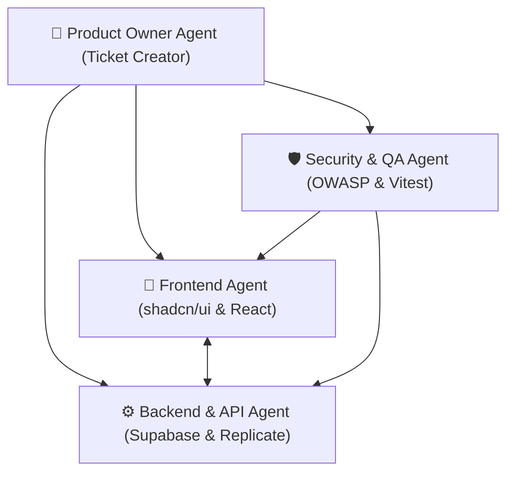

# 🤖 Définition des Agents Spécialisés du Projet NutriVision AI / App Cherry

Ce document définit la spécialisation, les compétences et les instructions de chaque agent IA impliqué dans l'exécution des tickets de développement.

---

## 👥 1. Équipe d'Agents Spécialisés

---

### 1️⃣ Agent 1 : Product Owner & Technical Analyst (`po-agent`)
- **Rôle** : Découper les fonctionnalités métier, rédiger et maintenir la spécification des tickets.
- **Skill principal** : `ticket-creator`, `ticket-analyst`
- **Tâches** :
  - Veiller au respect du cahier des charges.
  - S'assurer que chaque ticket contient ses critères d'acceptation (AC).

### 2️⃣ Agent 2 : Développeur Frontend `shadcn/ui` (`frontend-agent`)
- **Rôle** : Implémenter les composants d'interface utilisateur en React / Next.js avec `shadcn/ui` et Tailwind CSS.
- **Skill principal** : `frontend-dev`, `modern-web-guidance`, `verifying-in-browser`
- **Tâches** :
  - Créer les pages et composants réactifs (`src/features/...`).
  - Assurer l'accessibilité WCAG AA et le rendu Mobile-First (Dialog vs Drawer).
  - Lier les formulaires avec `react-hook-form` et `zod`.

### 3️⃣ Agent 3 : Développeur Backend & Data (`backend-agent`)
- **Rôle** : Développer les API routes Next.js, configurer les schémas PostgreSQL Supabase et l'intégration Replicate API.
- **Skill principal** : `backend-dev`, `architecture-decision-records`
- **Tâches** :
  - Rédiger les scripts SQL et appliquer la sécurité Row Level Security (RLS).
  - Créer les routes proxy `/api/ai/analyze-meal` et `/api/ai/weekly-summary`.
  - Valider l'étanchéité des requêtes et le typage TypeScript Zod.

### 4️⃣ Agent 4 : Expert Sécurité & QA Testing (`security-qa-agent`)
- **Rôle** : Garantir la sécurité OWASP et la couverture de tests automatisés.
- **Skill principal** : `auditing-security`, `auto-type-checking`
- **Tâches** :
  - Configurer les suites de tests unitaires et d'intégration avec **Vitest** et **MSW**.
  - Enforcer le Rate Limiting (`@upstash/ratelimit`) et la purification anti-XSS (`DOMPurify`).
  - S'assurer qu'aucun secret (`REPLICATE_API_TOKEN`) ne fuite.
