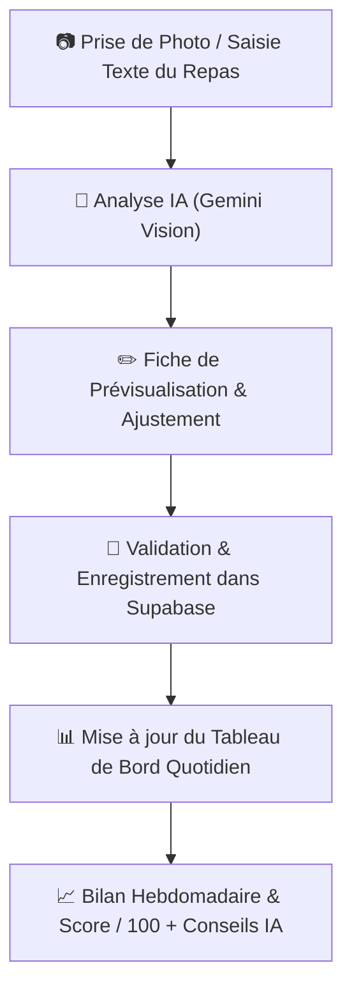

# 🍏 NutriVision AI - Spécifications & Architecture de l'Application

> ⚠️ **DOCUMENT OBSOLÈTE — remplacé par [decisions/001-stack-selection.md](decisions/001-stack-selection.md) et [decisions/002-replicate-ai-choice.md](decisions/002-replicate-ai-choice.md)**
>
> Ce brouillon initial envisageait React Native/Expo + Gemini/GPT-4o Vision. La stack **réellement retenue** dans les 16 tickets est **Next.js 14 + Supabase + Replicate**, installable sur iPhone comme **PWA** (bouton "Ajouter à l'écran d'accueil" de Safari) — sans compte Apple Developer, sans Xcode, et compatible avec tous les composants `shadcn/ui` déjà spécifiés dans les tickets. Conservé ici pour historique uniquement.

Ce document définit les choix d'architecture, la réponse aux interrogations concernant l'écosystème Apple, et la feuille de route pour développer votre application de suivi nutritionnel intelligent.

---

## 💡 Réponses aux questions sur la partie Apple / iOS

Développer une application mobile pour iOS soumet souvent à des contraintes (Mac requis, compte Apple payant à $99/an, processus de validation strict). Voici la solution grâce à la stack choisie :

1. **Test immédiat sur iPhone sans compte Apple Payant** :
   - En utilisant **Expo Go** (application gratuite disponible sur l'App Store iOS), vous scannez un QR Code depuis le terminal de votre ordinateur.
   - L'application s'exécute directement en natif sur votre iPhone **sans avoir besoin d'un Mac ni de payer 99$/an**.
2. **Pas besoin de Mac pour compiler l'app iOS** :
   - Expo propose le service **EAS Build (Expo Application Services)** qui comporte des serveurs cloud pour générer les fichiers `.ipa` pour iOS.
3. **Publication sur l'App Store (Quand vous serez prêt)** :
   - Le compte **Apple Developer (99$/an)** ne sera nécessaire qu'au moment où vous souhaiterez publier l'app officiellement sur l'App Store pour le grand public.

---

## 🛠️ Tech Stack Sélectionnée

| Composant | Technologie Choisie | Rôle & Avantages |
| :--- | :--- | :--- |
| **Frontend Mobile** | **React Native avec Expo** | Application mobile native iOS & Android avec accès caméra, UI fluide et rechargement à chaud. |
| **Analyse Repas IA** | **Gemini 1.5 Flash / GPT-4o Vision API** | Analyse instantanée de la photo ou description textuelle pour extraire aliments, portion, calories et macros. |
| **Backend & Database** | **Supabase (PostgreSQL + Auth + Edge Functions)** | Stockage sécurisé de l'historique des repas, des profils utilisateurs et sécurisation des clés API IA. |
| **UI & Styling** | **NativeWind (Tailwind pour React Native) / Lucide Icons** | Design moderne, propre, responsive et responsive aux thèmes sombre/clair. |

---

## 📱 Parcours Utilisateur & Fonctionnalités

### 1. Prise de repas (Photo / Texte)
- Prise de photo en direct ou importation depuis la galerie.
- Champ texte alternatif pour décrire le repas (ex: *"Un bol de flacons d'avoine, 200ml de lait d'amande et une banane"*).
- Envoi à l'IA Vision pour structuration JSON : `[ { aliment, poids_estime, calories, proteines, glucides, lipides } ]`.

### 2. Validation & Édition
- Écran de contrôle permettant d'ajuster le poids ou de corriger un ingrédient mal détecté avant enregistrement.

### 3. Tableau de Bord Quotidien
- Jauges de progression visuelles :
  - **Calories** (Consommées vs Objectif journalier)
  - **Protéines, Glucides, Lipides**
- Liste chronologique des repas de la journée (Petit-déjeuner, Déjeuner, Dîner, Collation).

### 4. Suivi Hebdomadaire & Coaching IA
- Graphique d'évolution des apports sur 7 jours.
- **Score de qualité nutritionnelle** sur 100 basé sur l'atteinte des objectifs et la régularité.
- **Rapport de conseils personnalisés** généré chaque fin de semaine par l'IA (ex: *"Excellente régularité en protéines, mais pensez à inclure plus de légumes verts pour équilibrer vos apports en fibres"*).

---

## 🚀 Prochaines Étapes de Développement

1. **Initialisation du projet Expo React Native** avec la structure de navigation (`expo-router`).
2. **Création du composant Caméra / Uploader de photo**.
3. **Intégration du service d'analyse IA Vision**.
4. **Mise en place du tableau de bord quotidien & jauges**.
5. **Configuration Supabase & Génération du rapport hebdomadaire**.
